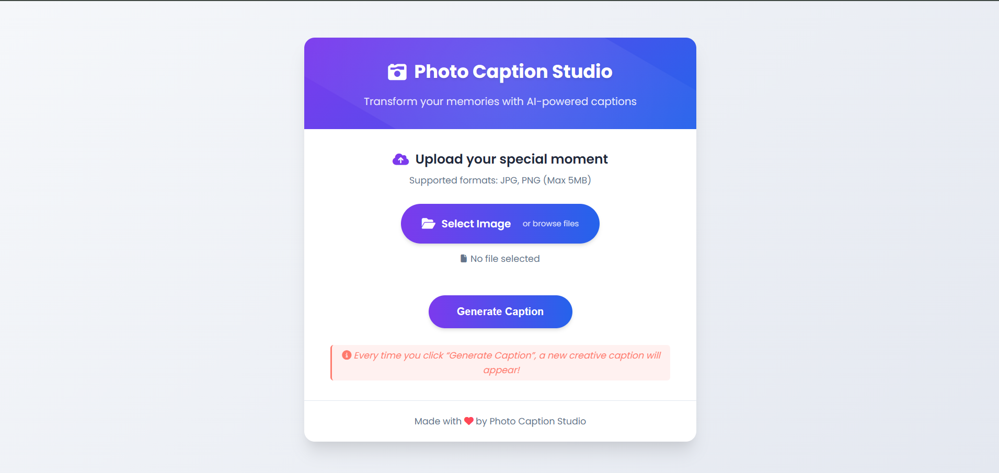

# 📸 Photo Caption Studio  

AI-powered web app that generates **fun, trendy, and poetic captions** for your uploaded photos using BLIP2 and FLAN-T5 models.  

---

## 🚀 Features
- Upload JPG/PNG images (up to 5MB).  
- Get **AI-generated captions** instantly.  
- Captions rewritten in creative, social-media style with emojis.  
- Responsive UI with live preview and copy-to-clipboard option.  

---

## 📂 Project Structure

project/
│── app.py # Flask backend
│── templates/
│ └── index.html # Frontend (HTML + JS)
│── static/
│ ├── css/
│ │ └── style.css # Styling
│ └── uploads/ # Temporary image uploads


---

## ⚡ Installation & Run Locally

### 1️⃣ Clone the repository
```bash
git clone https://github.com/Swati2005prajapati/codsoft_task2.git
cd codsoft_task2

2️⃣ Create virtual environment (recommended)
python -m venv venv
source venv/bin/activate   # On Windows: venv\Scripts\activate

3️⃣ Install dependencies
pip install -r requirements.txt


(Dependencies: Flask, Pillow, Torch, Transformers)

4️⃣ Run the app
python app.py


Server will start at:
👉 http://127.0.0.1:5000

🎮 How to Use

Upload an image (JPG/PNG).

Click Generate Caption.

Get AI-generated caption with emojis ✨.

Copy caption and share on social media.

## 📸 Screenshots




🔗 Links

📂 GitHub Repo: Click Here

🎥 LinkedIn Post: (link to task completion video)


💡 Tech Stack

Frontend: HTML, CSS, JavaScript

Backend: Flask (Python)

AI Models: BLIP2-flan-t5-xl, FLAN-T5-large (HuggingFace Transformers)

👩‍💻 Author

Made with ❤️ by Swati Prajapati


